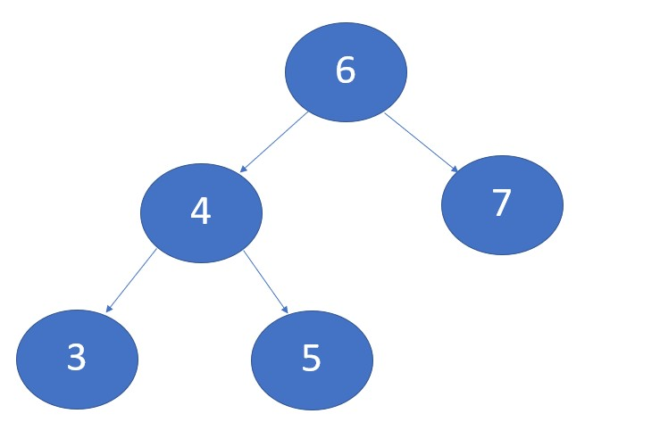

# Trees
## Introduction
In this module, we will have the opportunity to learn about Bianary Trees.  We will go over what trees exactly are, how efficent they are, and show example of how it looks in the Python programming language.  At the end of this section, we will have an example problem of how to add values to a tree.  You will then have the opportunity to do a practice problem of checking th esize of a Bianary Tree.

##  What are Bianary Trees
Trees are like linked lists.  You have a lot of Nodes connected by pointers.  Unlike a linked_list, trees can have multiple lines of nodes connected together.  In this module, we will mainly be working with binary trees, but know that we can have more than two branches of Nodes.

A binary tree has a few different parts of it.  Whenever a node has other nodes connected to it is called the parent and the nodes connected to the parent are the child nodes. The very top of the tree is called the root and from there the nodes that bracnh out are called leaf nodes.  

Now the explination given above may sound a bit confusing.  To help with this we have drawn a diagram to help you vizualize what we are talking about:

Figure1:


How a tree works is it works by size.  Starting at the root, numbers smaller than the root(or parent if we are lower on the tree) will always go to the left of that node.  Numbers that are bigger than the parent or root will go to the right.  Lets look at a diagram down below to see this in action:

Figure 2:


Notice how the number 4 is smaller than the number 6.  So in the tree we put it to the left.  If we want 7 in the tree, we place it to the right of 6.  Now lets say we wanted 3 to be in the tree.  So if we start at 6, we see that it is smaller than 6.  So we go to the left of 6, but find there is a 4 there already.  What do we do?  We do the same thing as before, we compare that parent with the number we want to add to the tree and see if it is bigger or smaller than 4.  Since 3 is smaller than 4, it goes to the left of 4.(See Figure 2 for visual).

## How to impliment a Bianary Tree
To impliment a Binnary tree in python, we will have to build a class to help keep track of the following features:
The node data, what is left of the node, and what is right of the node. 

The code for what we just mentioned could look like this:

``` python

class Node:

    #Our class contructor
    def __init__(self, data):
        self.left = None
        self.right = None
        self.data = data
```

Now a tree has many more features like adding or removing nodes so lets take a look at this in the next section.

##  How to Manipulate Bianary Trees and Efficeny of Bianary Trees
Trees are intersting to manipulate.  down below are some of the common ways we can maniuplate trees:

Set Operation       |         Description             | Effincency
--------------------|---------------------------------|------
insert( )           | add value to tree               | O(log n)
remove( )           | remove value from tree          | O(log n)
contains( )         | if value is in tree             | O(log n)
traverse_forward( ) | largest value to smallest value | O(n)
traverse_reverse( ) | largest value to smallest value | O(n)
height( )           | Show how many levels of the tree| O(n)
size( )             | Returns size of tree            | O(1)
empty( )            | shows if no nodes are present   | O(1)


###  Example: adding to a tree
Now lets take a look at an example problem that use what we talked about from up above.  We will take two sets of numbers and manipulate them in the different ways we discussed.  The code down below show each of the differet ways we can manipulate a set.  Feel free to copy and paste the code to see it run in real time.

```python

 ```

##  Practice Problem: Verify Email

Now its time for you to try out Bianary Trees!  First, download this [tree_problem](tree_problem.py) file.  When you open the file, notice two functions you have to code.  

### Problem 1:


### Problem 2:


   [Tree Problem Solution](tree_problem_solution.py)

[Back to Welcome Page](0-welcome.md)